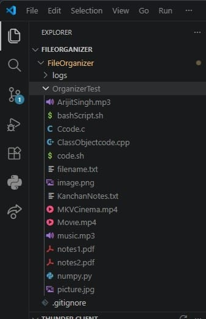
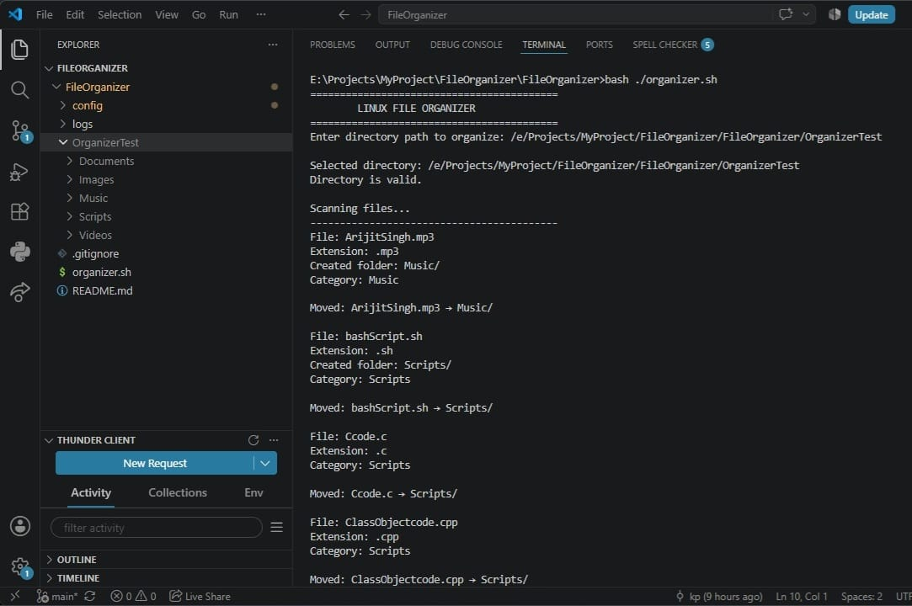
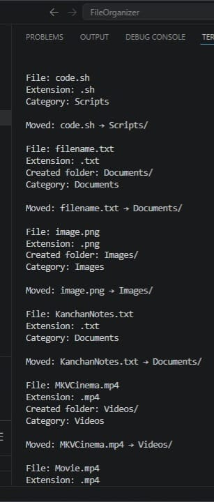
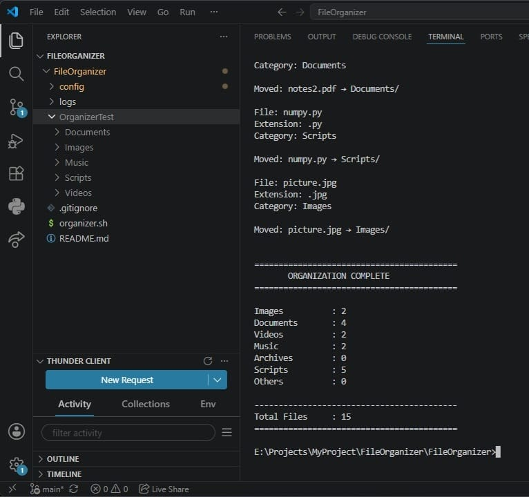

# 🐧 Linux File Organizer

A lightweight Linux and Bash-based automation tool that automatically organizes files into category-based folders according to their file extensions.

The project is designed as a small, standalone Linux automation utility that helps keep directories such as `Downloads` clean and organized.


---

## 📌 Project Overview

In a typical Linux directory, files of different types may be stored together, making it difficult to locate and manage them.

**Linux File Organizer** automates this process by detecting file extensions and moving files into appropriate category folders.

For example:

```text
Before:

Downloads/
├── photo.jpg
├── resume.pdf
├── song.mp3
├── movie.mp4
├── setup.zip
└── script.sh
```

After running the organizer:

```text
Downloads/
├── Images/
│   └── photo.jpg
├── Documents/
│   └── resume.pdf
├── Music/
│   └── song.mp3
├── Videos/
│   └── movie.mp4
├── Archives/
│   └── setup.zip
└── Scripts/
    └── script.sh
```


## 📸 Screenshots

### 1. Test Directory Before Organization

The test directory contains files of different types and extensions before running the Linux File Organizer.



---

### 2. File Detection and Categorization

The organizer detects each file, identifies its extension, assigns the appropriate category, and moves the file to the corresponding folder.



---

### 3. Automatic File Organization

Files are automatically moved into their respective category folders such as `Documents`, `Images`, `Music`, `Videos`, and `Scripts`.



---

### 4. Final Organization Summary

After processing all files, the organizer displays a summary containing the number of files organized in each category and the total number of files processed.




---

## 🎯 Objectives

* Automate file organization in Linux directories.
* Categorize files based on their extensions.
* Reduce manual file management.
* Prevent accidental overwriting of existing files.
* Provide a safe dry-run mode before making changes.
* Maintain an activity log of organization operations.
* Keep file-category mappings configurable.
* Demonstrate practical Linux and Bash scripting concepts.

---

## ✨ Features

### Core Features

* Directory selection through command-line input.
* Directory existence validation.
* Automatic file detection.
* Case-insensitive extension detection.
* Extension-based file categorization.
* Automatic category folder creation.
* Automatic file movement.
* Unknown file handling through `Others/`.
* Duplicate filename handling.
* File organization summary.
* Empty directory detection.

### Additional Features

* `--help` command.
* `--version` command.
* `--dry-run` preview mode.
* Activity logging.
* Configurable file categories.
* Support for filenames containing spaces.
* Support for uppercase and lowercase extensions.

---

## 📂 File Categories

The organizer currently supports the following categories:

| Category  | Example Extensions                                                                |
| --------- | --------------------------------------------------------------------------------- |
| Images    | `.jpg`, `.jpeg`, `.png`, `.gif`, `.svg`, `.ico`, `.tiff`, `.tif`, `.bmp`, `.webp` |
| Documents | `.pdf`, `.doc`, `.docx`, `.txt`, `.odt`, `.xls`, `.xlsx`, `.ppt`, `.pptx`         |
| Videos    | `.mp4`, `.mkv`, `.avi`, `.mov`, `.wmv`, `.flv`                                    |
| Music     | `.mp3`, `.wav`, `.flac`, `.aac`, `.ogg`                                           |
| Archives  | `.zip`, `.tar`, `.gz`, `.rar`, `.7z`                                              |
| Scripts   | `.sh`, `.py`, `.js`, `.c`, `.cpp`, `.java`                                        |
| Others    | Unknown or unsupported extensions                                                 |

File extensions are converted to lowercase before classification, so extensions such as `.JPG`, `.jpg`, `.PNG`, and `.png` are handled consistently.

---

## 🛠️ Technologies Used

* **Linux**
* **Bash Shell Scripting**
* Standard Linux/Unix utilities

### Bash/Linux Concepts Used

* Variables
* Conditional statements
* `if`
* `case`
* `for` loops
* Functions
* Command-line arguments
* Parameter expansion
* `basename`
* `mkdir`
* `mv`
* `date`
* `tr`
* File and directory tests

---

## 📁 Project Structure

```text
LinuxFileOrganizer/
│
├── organizer.sh
│
├── config/
│   └── organizer.conf
│
├── logs/
│   └── organizer.log
│
├── README.md
└── .gitignore
```

### `organizer.sh`

Main Bash script responsible for:

* Reading the target directory.
* Detecting files.
* Identifying extensions.
* Determining categories.
* Creating category folders.
* Moving files.
* Handling duplicates.
* Generating summaries.
* Supporting command-line options.

### `config/organizer.conf`

Contains configurable extension mappings.

Example:

```bash
IMAGES="jpg jpeg png gif svg ico tiff tif bmp webp"
DOCUMENTS="pdf doc docx txt odt xls xlsx ppt pptx"
VIDEOS="mp4 mkv avi mov wmv flv"
MUSIC="mp3 wav flac aac ogg"
ARCHIVES="zip tar gz rar 7z"
SCRIPTS="sh py js c cpp java"
```

### `logs/organizer.log`

Stores organization activity such as file movements, duplicate handling, and dry-run operations.

---

## ⚙️ How It Works

The organizer follows this workflow:

```text
Start
  │
  ▼
Read Directory Path
  │
  ▼
Validate Directory
  │
  ├── Invalid → Display Error → Exit
  │
  ▼
Scan Files
  │
  ▼
Extract File Extension
  │
  ▼
Convert Extension to Lowercase
  │
  ▼
Read Category Configuration
  │
  ▼
Determine File Category
  │
  ▼
Create Category Folder
  │
  ▼
Check Duplicate Filename
  │
  ├── Duplicate → Generate New Filename
  │
  ▼
Move File
  │
  ▼
Update Counters
  │
  ▼
Display Summary
  │
  ▼
End
```

---

## 🚀 Installation

Clone the repository:

```bash
git clone https://github.com/Kanchan-Prajapat/FileOrganizer
```

Navigate to the project directory:

```bash
cd LinuxFileOrganizer
```

Give execute permission to the script:

```bash
chmod +x organizer.sh
```

---

## ▶️ Usage

### Normal Mode

Run:

```bash
./organizer.sh
```

The script asks for the directory to organize:

```text
Enter directory path to organize:
```

Enter a directory such as:

```text
/home/user/Downloads
```

---

## 📖 Help

To display available commands:

```bash
./organizer.sh --help
```

Available options:

```text
--help       Show help information
--version    Show program version
--dry-run    Preview changes without moving files
```

---

## 🔢 Version

Check the current version:

```bash
./organizer.sh --version
```

Example output:

```text
Linux File Organizer v1.0
```

---

## 👀 Dry Run Mode

Dry-run mode allows the user to preview the organization process without actually moving files.

Run:

```bash
./organizer.sh --dry-run
```

Example:

```text
DRY RUN MODE
No files will be moved.

File: photo.jpg
Extension: .jpg
Category: Images
Would move: photo.jpg → Images/

File: resume.pdf
Extension: .pdf
Category: Documents
Would move: resume.pdf → Documents/
```

This provides a safe way to verify the expected result before performing actual file operations.

---

## 🔄 Duplicate Filename Handling

The organizer prevents accidental overwriting of files.

If:

```text
Images/photo.jpg
```

already exists and another `photo.jpg` needs to be moved, the organizer automatically generates a new filename:

```text
photo_1.jpg
photo_2.jpg
photo_3.jpg
```

This ensures that existing files are preserved.

---

## 📝 Logging

The organizer maintains an activity log in:

```text
logs/organizer.log
```

Example:

```text
2026-08-15 22:30:12 | MOVED | photo.jpg | Images/
2026-08-15 22:30:15 | MOVED | resume.pdf | Documents/
2026-08-15 22:31:05 | DUPLICATE | photo.jpg | photo_1.jpg
```

Dry-run operations can also be recorded for reference.

---

## 🧪 Testing

The project was tested using a separate test directory containing different file types.

Example:

```text
OrganizerTest/
├── photo.jpg
├── resume.pdf
├── song.mp3
├── movie.mp4
├── setup.zip
├── script.sh
└── unknown.xyz
```

### Test Cases

* Normal file organization
* Multiple file types
* Uppercase extensions
* Unknown extensions
* Duplicate filenames
* Empty directory
* Invalid directory path
* Already organized files
* Files containing spaces
* SVG image files
* Dry-run mode
* Help command
* Version command
* Invalid command-line option

---

## 📊 Example Output

```text
==========================================
       ORGANIZATION COMPLETE
==========================================

Images          : 3
Documents       : 2
Videos          : 1
Music           : 2
Archives        : 1
Scripts         : 1
Others          : 1

------------------------------------------
Total Files     : 11
==========================================
```

---

## ✅ Advantages

* Simple and lightweight.
* No external dependencies.
* Easy to understand and maintain.
* Saves time during file management.
* Prevents duplicate filename overwriting.
* Supports safe preview through dry-run mode.
* Provides activity logging.
* Categories can be modified through configuration.
* Demonstrates practical Linux automation.

---

## ⚠️ Limitations

* Currently operates on a single selected directory at a time.
* File categorization depends on configured extensions.
* It does not inspect file contents to determine their actual type.
* It is designed primarily for Linux/Bash environments.
* Advanced file types may need to be added to the configuration file.

---

## 🔮 Future Scope

Possible future improvements include:

* Recursive organization of subdirectories.
* Interactive menu-based interface.
* More configurable categories.
* File type detection using MIME types.
* Scheduled automatic organization using cron.
* Improved reporting and statistics.
* Optional backup before file movement.
* Support for custom user-defined categories.

These features are intentionally outside the current scope to keep the project lightweight and focused.

---

## 🎓 Learning Outcomes

Through this project, the following concepts were practically implemented:

* Linux file-system operations.
* Bash shell scripting.
* File and directory handling.
* Conditional logic.
* Loops and functions.
* Command-line arguments.
* File extension processing.
* Configuration management.
* Logging.
* Error handling.
* Automation of repetitive Linux tasks.

---

## 📌 Conclusion

Linux File Organizer is a compact Linux automation project that demonstrates how Bash scripting can be used to solve a practical file-management problem.

The tool automatically detects file types, categorizes files, creates required directories, handles duplicate filenames, provides a dry-run mode, maintains logs, and generates an organization summary.

The project provides a practical demonstration of Linux filesystem automation while remaining simple, standalone, and easy to maintain.

---

## 📚 References

* Linux Manual Pages (`man`)
* Bash Manual
* GNU Coreutils Documentation
* Linux filesystem documentation

---

## 👩‍💻 Author

**Kanchan Prajapat**

Linux & Bash Automation Project
